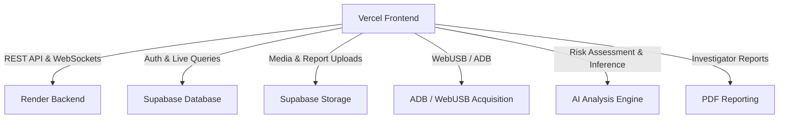

# ForenAI — Forensic Intelligence & Device Recovery System

ForenAI is a state-of-the-art forensic investigation and data recovery platform designed for incident responders and digital investigators. It features browser-based, agentless hardware acquisition, real-time file carving, automated YARA malware signature scanning, and explainable AI-driven risk classification.

## System Architecture

### Architectural Flow

1. **Vercel Frontend**
   - The user-facing dashboard is hosted on **Vercel** and built with **React**, **TypeScript**, and **Vite**. It employs a premium glassmorphic UI with micro-animations and a responsive dark-theme design.
   - Core Routing & Data Fetching: Handled via React Query.
   - Entry point: [App.tsx](file:///e:/forenai/src/frontend/src/App.tsx)

2. **Render Backend**
   - The core forensic orchestrator is hosted on **Render** using a custom Python standard library HTTP server ([server.py](file:///e:/forenai/backend/server.py)).
   - Exposes REST API endpoints for scanning drives, computing cryptographic hashes, performing file carving, and executing YARA signature scans.

3. **Supabase Database**
   - A PostgreSQL instance hosted on **Supabase** handles authentication, audit trails, and analysis details.
   - Key client: [supabase.ts](file:///e:/forenai/src/frontend/src/lib/supabase.ts)

4. **Supabase Storage**
   - Stores forensic file dumps, carved file chunks, and compiled reporting logs securely.

5. **ADB / WebUSB Acquisition**
   - Uses WebUSB via the browser ([webadbService.ts](file:///e:/forenai/src/frontend/src/services/webadbService.ts)) to communicate with connected Android devices using the `@yume-chan/adb` protocol.
   - Acquires live calls, SMS messages, package installations, location markers, hidden media, and device metadata without requiring pre-installed root agents.

6. **AI Analysis Engine**
   - Evaluates device profiles, permission combinations, and file signatures to assign a Forensic Risk Score.
   - Provides explainable AI reasoning steps displayed on the [AIAnalysisPage.tsx](file:///e:/forenai/src/frontend/src/pages/AIAnalysisPage.tsx).

7. **PDF Reporting**
   - Generates cryptographically hashed evidence manifests and exports detailed PDF reports using [reportService.ts](file:///e:/forenai/src/frontend/src/services/reportService.ts).

## Main Components & Modules

### Frontend Services

- **Acquisition**: [webadbService.ts](file:///e:/forenai/src/frontend/src/services/webadbService.ts) — WebUSB/ADB shell orchestrator.
- **Backend API client**: [backendApi.ts](file:///e:/forenai/src/frontend/src/services/backendApi.ts) — Communication with python backend.
- **AI Engine client**: [aiService.ts](file:///e:/forenai/src/frontend/src/services/aiService.ts) — Dynamic risk classification helper.
- **PDF Exporter**: [reportService.ts](file:///e:/forenai/src/frontend/src/services/reportService.ts) — Report compiler.

### Python Backend & Recovery Engine

- **Server Entry**: [server.py](file:///e:/forenai/backend/server.py) — Custom HTTP API layer.
- **Recovery Manager**: [recovery_manager.py](file:///e:/forenai/backend/recovery/recovery_manager.py) — Gateway interface unifying the forensic sub-modules.
- **Disk Scanner**: [disk_scanner.py](file:///e:/forenai/backend/recovery/disk_scanner.py) — Physical drives and logical partition reader.
- **File Carver**: [file_carver.py](file:///e:/forenai/backend/recovery/file_carver.py) — Signature-based (magic numbers) buffer scanner.
- **Hash Verifier**: [hash_verifier.py](file:///e:/forenai/backend/recovery/hash_verifier.py) — MD5, SHA-1, and SHA-256 verifications.
